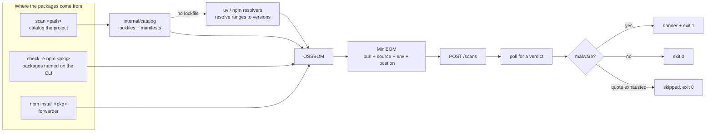
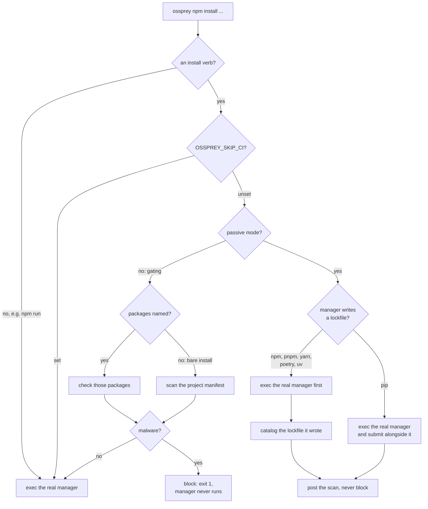
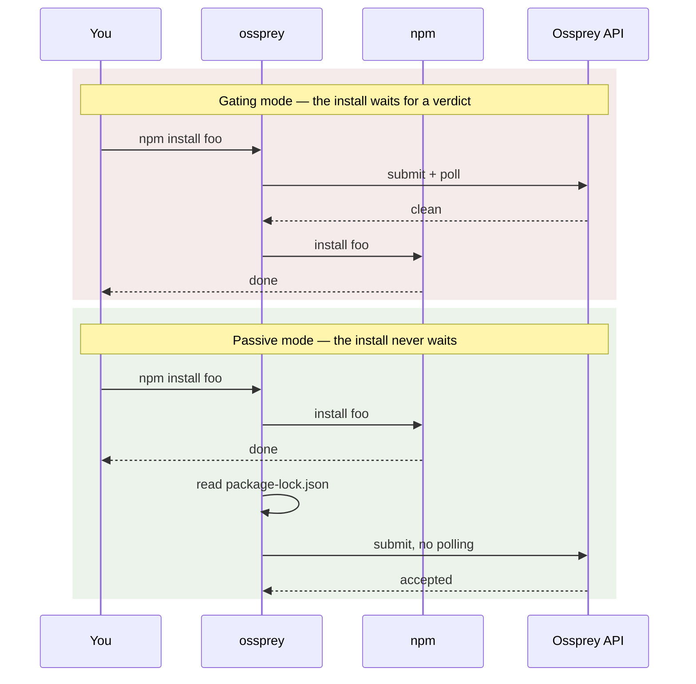

# How it works — diagrams

What happens between your command and a verdict.

## The scan pipeline

Every command ends in the same place: a list of packages, compressed to a wire
format, checked against the Ossprey API. Nothing here executes your project's
package manager except the two resolvers marked below, and those only run when
a manifest ships without a lockfile.

## A forwarded install

The forwarder decides what to check from the command line alone. Everything it
does not recognise is forwarded untouched — the failure mode is always "the
install still works".

The passive branch is the one worth reading twice. It never gates, so it never
sits in front of the install: on a lockfile manager the install runs first and
Ossprey then reads the lockfile it wrote, which is both faster and more
accurate than predicting the tree beforehand.

---

[← Back to the docs index](README.md)
